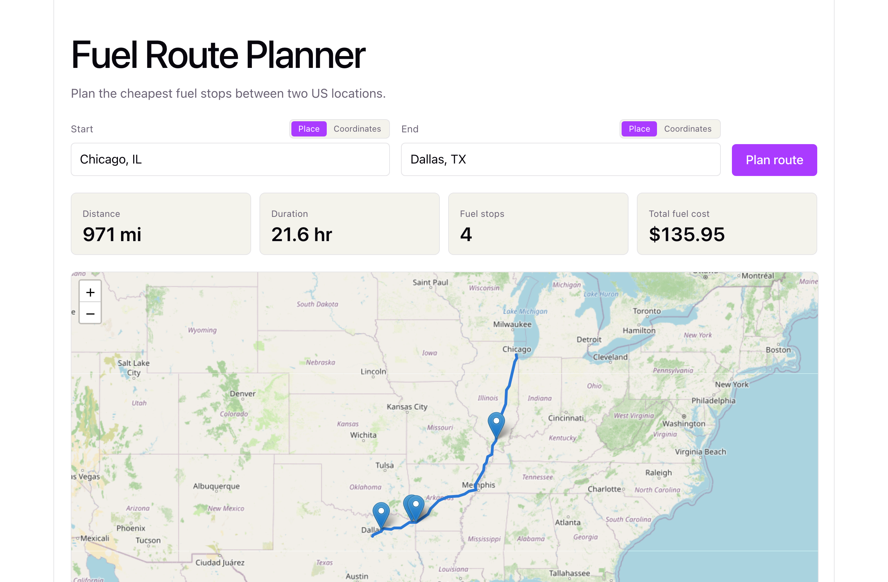

<p align="center">
  
</p>

<h1 align="center">Fuel Route Planner</h1>

<p align="center">
  Given a start and end location in the US, returns the driving route, the cheapest sequence<br>
  of fuel stops a 500-mile-range truck needs to make, and the total fuel cost at 10 MPG.
</p>

<p align="center">
  <a href="https://d12yi4wtavx758.cloudfront.net"><strong>Live demo</strong></a> ·
  <a href="https://pjtcs90ffi.execute-api.us-east-1.amazonaws.com"><strong>API</strong></a> ·
  <a href="https://www.loom.com/share/d9ce7fa642164a36baeeef24b8833195?t=242"><strong>Demo video</strong></a>
</p>

<p align="center">
  
  
  
  
</p>



## What it does

1. Resolves the start/end locations and fetches a driving route from OpenRouteService: 1 external call if given coordinates, up to 3 if given free text (2 geocodes + 1 directions).
2. Matches ~6,500 real US truck-stop fuel prices against the route corridor.
3. Computes the cheapest sequence of fuel stops with a greedy algorithm: at each stop, if a cheaper station is reachable within the remaining 500-mile range, go there buying just enough to arrive; otherwise fill up completely and jump to the best-priced station still in range.
4. Returns the route geometry, the ordered stops (station, price, gallons purchased), and the total cost.

## Stack

| | |
|---|---|
| **Backend** | Django 6 + DRF, on AWS Lambda (via [Lambda Web Adapter](https://github.com/awslabs/aws-lambda-web-adapter), unmodified WSGI/gunicorn) behind API Gateway |
| **Frontend** | React + Vite + Leaflet, on S3 + CloudFront |
| **Routing** | [OpenRouteService](https://openrouteservice.org/) (free tier) |
| **Fuel data** | ~6,500 US truck stops from the provided CSV, geocoded offline against a static US-cities gazetteer, with zero live geocoding calls for the dataset itself |

No live database in production: the request path never queries one. Station data is cleaned, deduped, and geocoded once as a build step into a static JSON artifact that Lambda loads into memory at cold start.

## API

`POST /api/v1/route/`

```json
{ "start": "Chicago, IL", "end": "Dallas, TX" }
```

`start`/`end` accept either a free-text string or `{"lat": ..., "lng": ...}`.

```json
{
  "distance_miles": 971.0,
  "duration_hours": 21.6,
  "stops_required": true,
  "external_calls_used": 3,
  "total_fuel_cost_usd": 135.95,
  "fuel_stops": [
    {
      "name": "HUCKS FOOD & FUEL #379",
      "city": "Marion",
      "state": "IL",
      "price_per_gallon": 2.929,
      "gallons_purchased": 29.36,
      "cumulative_distance_miles": 317.6
    }
  ],
  "route_geometry": { "type": "LineString", "coordinates": [ ] }
}
```

Errors: `{"error": {"code": "...", "message": "...", "details": ...}}`, with codes `validation_error` (400), `identical_locations` (400), `unresolvable_location` (422), `infeasible_route` (422), `no_fuel_data_in_corridor` (422), and `upstream_routing_error` (502).

## Running locally

**Backend** (needs a free [OpenRouteService](https://openrouteservice.org/dev/#/signup) API key):

```bash
cd backend
python3 -m venv .venv && source .venv/bin/activate
pip install -r requirements.txt
cp .env.example .env               # fill in ORS_API_KEY
python manage.py migrate
python manage.py load_fuel_stations   # cleans/geocodes the CSV into data/fuel_stations.json
python manage.py runserver 8000
```

**Frontend:**

```bash
cd frontend
npm install
npm run dev   # http://localhost:5173
```

## Testing

```bash
cd backend && python manage.py test
```

81 tests, all offline (mocked/fixture-based) except two live smoke tests against the real routing API, opt-in via `RUN_LIVE_SMOKE_TESTS=1`. The fuel-stop algorithm is implemented three independent ways (brute force, dynamic programming, and the production greedy) and cross-checked against thousands of randomized trips, since this is the part most worth getting right.

## Deployment

Deployed via AWS SAM (Lambda + API Gateway + S3 + CloudFront). See [`deploy/README.md`](deploy/README.md) for the exact commands.

## Project structure

```
backend/         Django + DRF API
  routing/       OpenRouteService client, request orchestration, the API view
  optimization/  Corridor filtering + the fuel-stop algorithm (pure functions, no framework dependency)
  stations/      FuelStation model, CSV ingestion, offline geocoding
frontend/        React + Vite + Leaflet UI
data/            Source CSV, offline gazetteer, and the geocoded station artifact
deploy/          SAM template packaging + frontend deploy scripts
```
